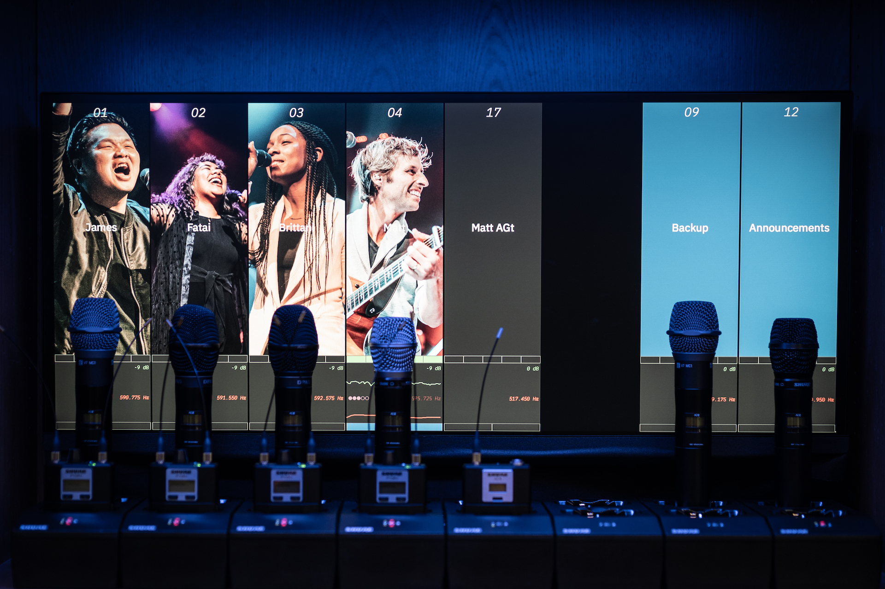
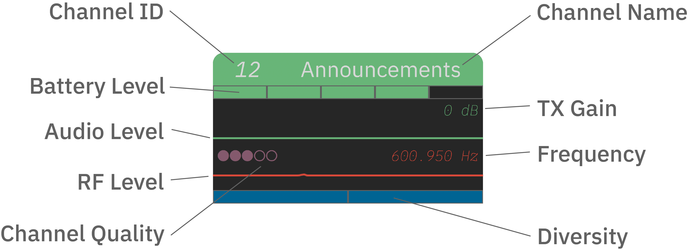
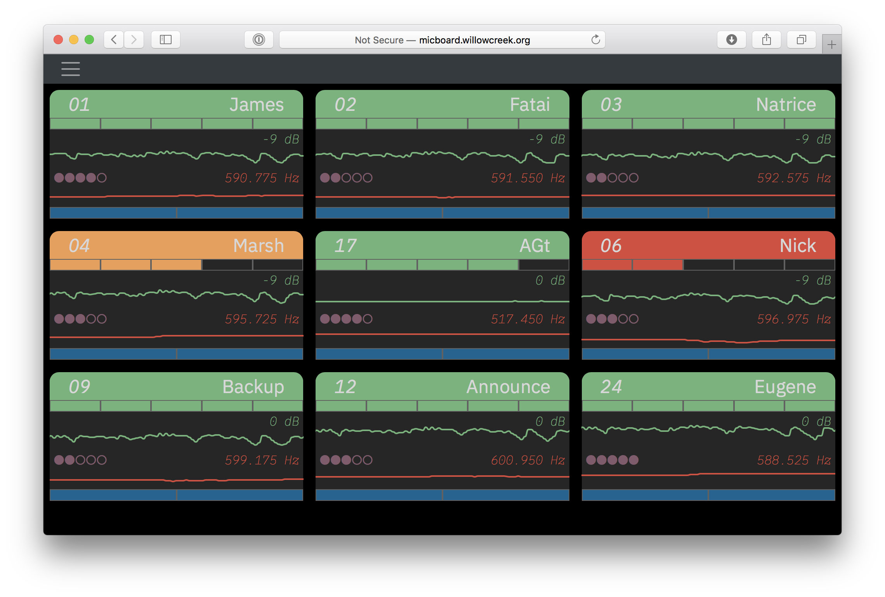
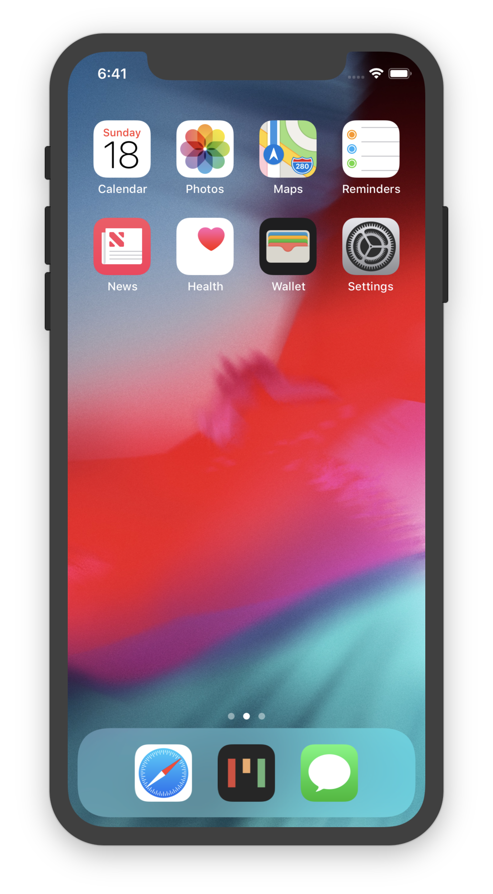
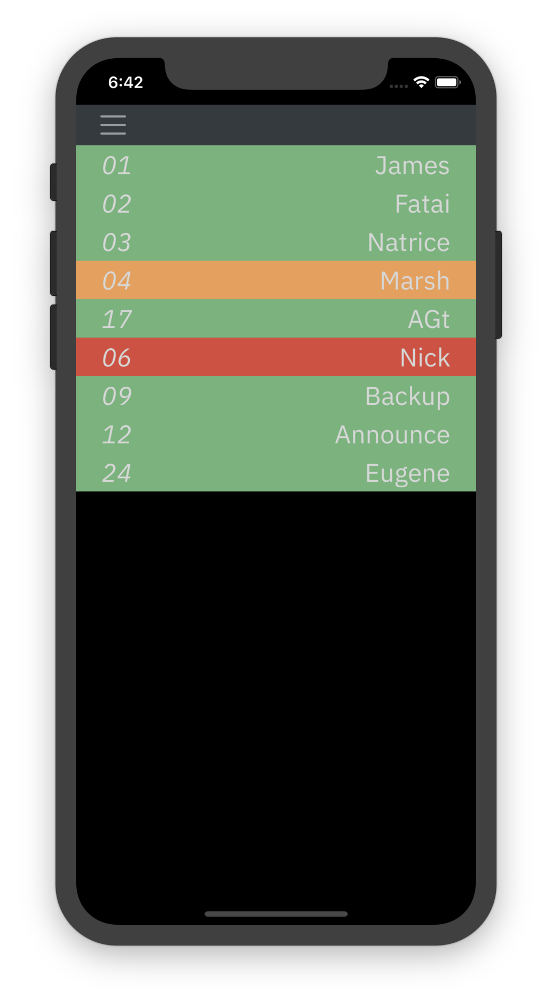
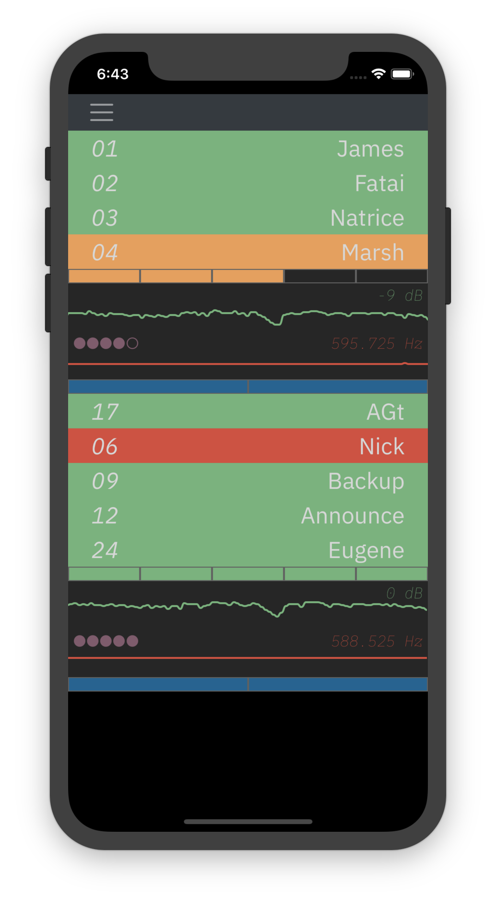
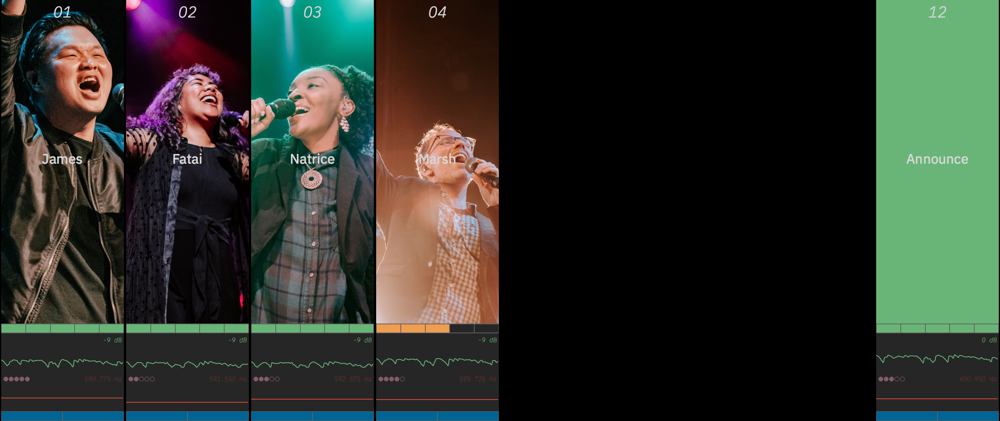

<p align="center">
  <a href="https://micboard.io"></a>
</p>

<h1 align="center">Micboard</h1>

A visual monitoring tool for network enabled Shure devices.  Micboard simplifies microphone monitoring and storage for artists, engineers, and volunteers.  View battery, audio, and RF levels from any device on the network.






## Screenshots
#### Desktop



#### Mobile
<p align="center">
  
</p>

#### Mic Storage


## Compatible Devices
Micboard supports the following devices -
* Shure UHF-R
* Shure QLX-D<sup>[1](#qlxd)</sup>
* Shure ULX-D
* Shure Axient Digital
* Shure PSM 1000

Micboard uses IP addresses to connect to RF devices.  RF devices can be addressed through static or reserved IPs.  They just need to be consistent.


## New Features (v0.8.5+)
* **Planning Center Services Integration** - Automatically sync performer names from your service plans
* **Google Drive Integration** - Automatically download background images from a shared folder
* **Python 3.12+ Support** - Updated for modern Python versions
* **Node.js 20+ Support** - Updated frontend build tools

## Requirements
* Python 3.12 or later
* Node.js 20 or later (for development)
* Windows, macOS, or Linux

## Quick Start
### Windows
```
run_server.bat
```

### macOS/Linux
```bash
chmod +x run_server.sh
./run_server.sh
```

Then open http://localhost:8058 in your browser.

## Documentation
* [Installation](docs/installation.md)
* [Configuration](docs/configuration.md)
* [Integrations (PCO & Google Drive)](docs/integrations.md)
* [Micboard MultiVenue](docs/multivenue.md)
* [Windows Setup Guide](README_WINDOWS.md)

#### Developer Info
* [Building the Electron wrapper for macOS](docs/electron.md)
* [Extending micboard using the API](docs/api.md)


## Known Issues
<a name="qlxd">1</a>: [QLX-D Firmware](docs/qlxd.md)
